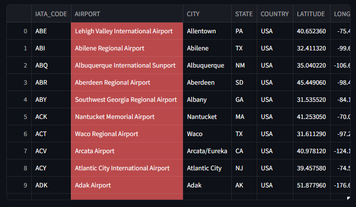
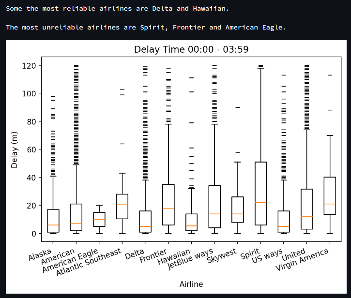
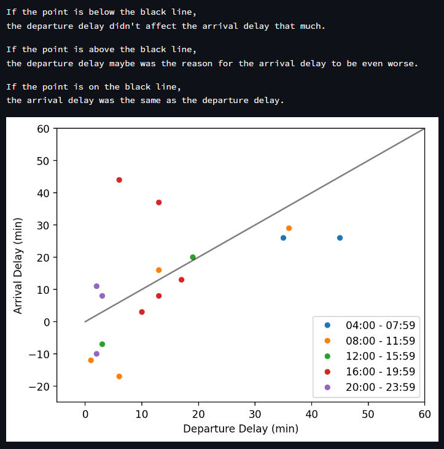

## Project Overview

The project aims to enhance the decision-making process for travelers looking to purchase plane tickets. By providing insightful and interactive visualizations of flight-related data, this project helps users make informed choices while also offering a better overall experience.

## Dataset

This project utilizes a large dataset containing approximately **5.8 million rows** of internal flights in the U.S. from **2015**. The dataset comprises four CSV files:

- **Flights**: Contains scheduled and actual times of departure, dates, airlines, cancellation reason codes, etc.
  
- **Airlines**: Includes full names and abbreviations of airlines.
  
- **Airports**: Contains airport names and their locations.
  
- **Cancellation Codes**: Provides cancellation codes and their full descriptions.
  

## Technology Stack

- **DuckDB**: Used for running queries on the large dataset to create smaller SQLite databases relevant to the graphs.
- **SQLite**: Used to fetch data from the smaller dataset to generate visualizations.
- **Streamlit**: A framework for building interactive web applications that display the visualizations.

## Features

The Streamlit dashboard includes **4 interactive graphs** that answer the following questions:

1. **Comparing Airlines by Departure Delay (interactive)**:  
   Users can choose the time of day to see which airline has the least departure delays during that time. (whisker plot)
   
   
2. **Top 10 Cancelled Flights Percentage Airports (interactive)**:  
   Users can select month(s) to generate a separate pie chart for each month showing the airports with the highest percentages of cancelled flights.
   

4. **Relationship Between Departure and Arrival Delay (interactive)**:  
   Users can choose the origin and destination airports along with a month to see a scatter plot showing how departure delays affect arrival delays, colored by time of day.
   

5. **Percentage for Each Cancellation Reason (interactive)**:  
   Users can select a month to see a pie chart illustrating the percentage of cancellations attributed to different reasons.
   
   
   
7. **Daily Flight Distance**:  
   A bar chart that displays the total distance covered by flights each day.
   
   
8. **Comparing Airlines by Flight Time**:  
   A bar chart that compares airlines based on average flight times.
   

## Installation and Usage

To run the application and generate the Streamlit dashboard, follow these steps:

1. **Download the Dataset**:  
   Go to [Maven Analytics Data Playground](https://mavenanalytics.io/data-playground?order=number_of_records%2Cdesc&pageSize=20) and download the **Airline Flight Delays** dataset.

2. **Extract the Dataset**:  
   Extract the downloaded files.

3. **Place the Extracted Folder in the Root Directory**:  
   Ensure that the folder is located in the root directory of the project.

4. **Run the Query Files**:  
   Execute all Python files that begin with the word **`query`**. This step generates the smaller datasets relevant to the graphs.

5. **Launch the Streamlit Dashboard**:  
   In the terminal, run the following command:
   ```bash
   streamlit run .\dashboard.py
   ```

Your default browser should open, displaying tables and graphs.

